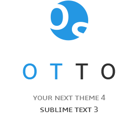
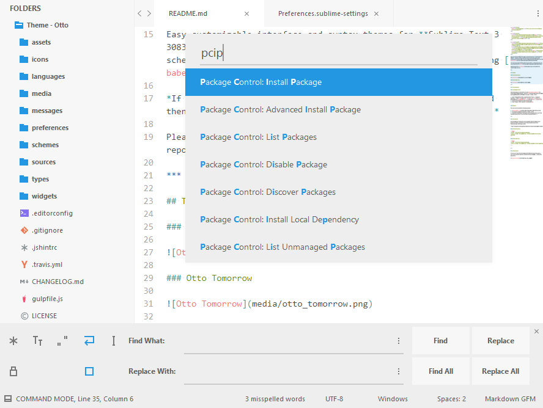
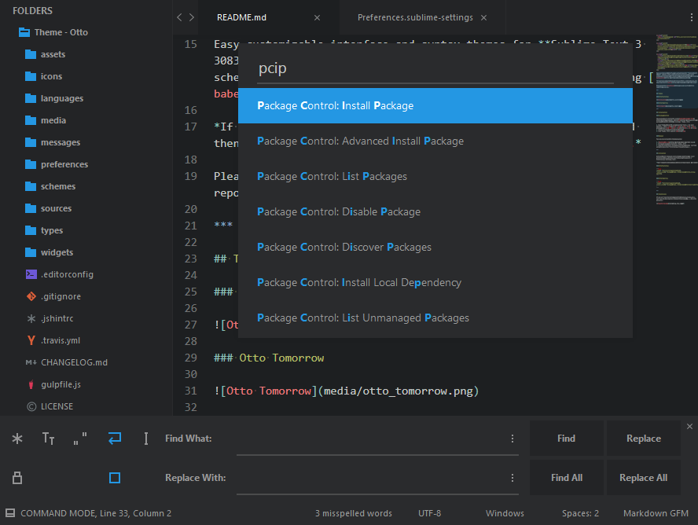
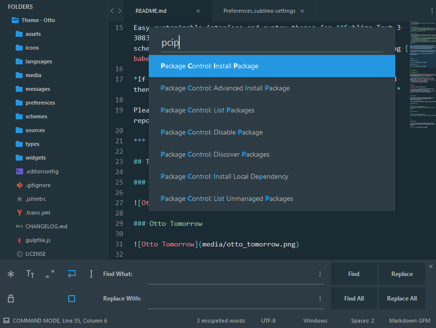
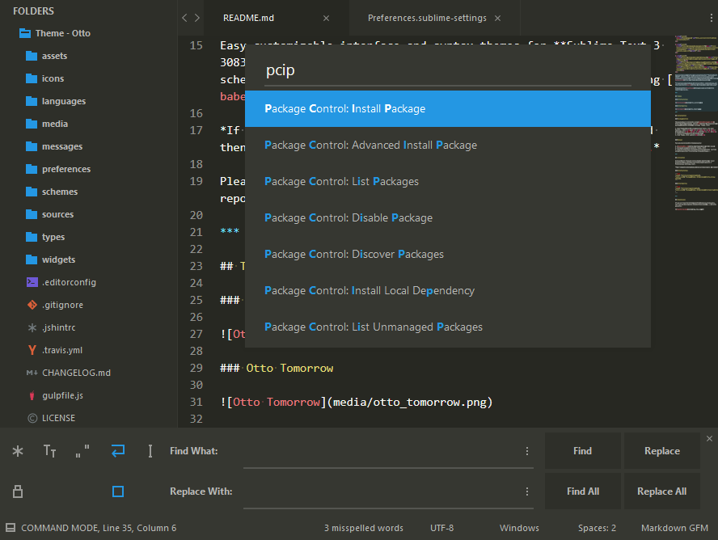
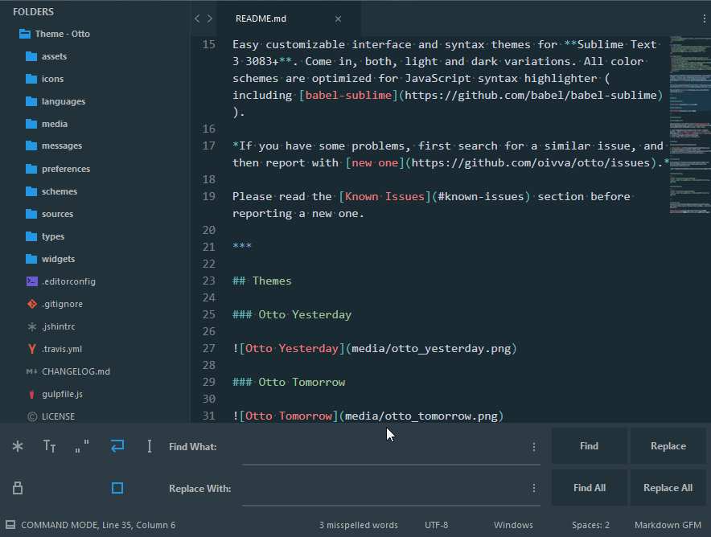

<p align="center">
  
</p>

<p align="center">
  <a href="https://pledgie.com/campaigns/31119"></a>
</p>

<p align="center">
  <a href="https://github.com/oivva/otto/releases"></a>
  <a href="https://packagecontrol.io/packages/Theme%20-%20Otto"></a>
  <a href="https://travis-ci.org/oivva/otto"></a>
</p>

Easy customizable interface and syntax themes for **Sublime Text 3 3083+**. Come in, both, light and dark variations. All color schemes are optimized for JavaScript syntax highlighter (including [babel-sublime](https://github.com/babel/babel-sublime)).

**NOTE:** Active tab has the same color as an active color scheme to fit it more gracefully.

*If you have some problems, first search for a similar issue, and then report with [new one](https://github.com/oivva/otto/issues).*

Please read the [Known Issues](#known-issues) section before reporting a new one.

***

## Themes

### Otto Yesterday

Best for light color schemes, especially good with **Otto Yesterday** & [**Base16 Tomorrow Light**](http://chriskempson.github.io/base16/#tomorrow).



### Otto Tomorrow

Best for dark color schemes, especially good with **Otto Tomorrow** & [**Zenburn**](https://github.com/colinta/zenburn).



### Otto Oceanic

Best for dark color schemes, especially good with **Otto Oceanic** & [**Solarized Dark**](https://github.com/braver/Solarized).



### Otto Monokai

Best for dark color schemes, especially good with [**Monokai Extended**](https://github.com/jonschlinkert/sublime-monokai-extended) & [**Monokai Neue**](https://github.com/josh-kaplan/sublime-monokai-neue).



***

## Installation

### Package Control

The easiest way to install is using [Sublime Package Control](https://sublime.wbond.net), where [Otto](https://packagecontrol.io/packages/Theme%20-%20Otto) is listed as `Theme - Otto`.

1. Open *Command Palette* using menu item `Tools -> Command Palette...` (OS X: <kbd>⌘</kbd> + <kbd>⇧</kbd> + <kbd>P</kbd> | Windows/Linux: <kbd>Ctrl</kbd> + <kbd>Shift</kbd> + <kbd>P</kbd>)
2. Choose `Package Control: Install Package`
3. Find `Theme - Otto` and hit <kbd>Enter</kbd>


### Manual

You can also install the theme manually:

1. [Download the .zip](https://github.com/oivva/otto/releases)
2. Unzip and rename the folder to `Theme - Otto`
3. Copy the folder into `Packages` directory, which you can find using the menu item `Preferences -> Browse Packages...`

***

## Activation

Activate the UI theme and color scheme by modifying your user preferences file, which you can find using the menu item `Preferences -> Settings - User`.

**DON'T FORGET TO RESTART SUBLIME TEXT AFTER ACTIVATING THE THEME.**

### Otto Yesterday

```json
"theme": "Otto Yesterday.sublime-theme",
"color_scheme": "Packages/Theme - Otto/schemes/Otto Yesterday.tmTheme",
```

### Otto Tomorrow

```json
"theme": "Otto Tomorrow.sublime-theme",
"color_scheme": "Packages/Theme - Otto/schemes/Otto Tomorrow.tmTheme"
```

***

## Known issues

If you can't see the bottom panel (find/replace, rename, move, can't see the box inputs in SidebarEnhancement, etc..). Here the quick fix:


